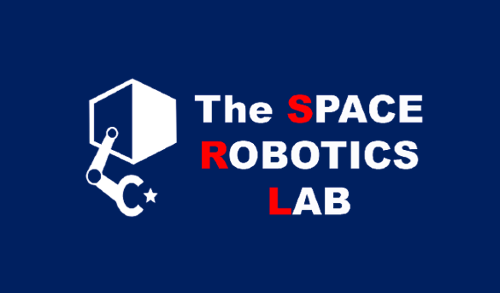

#  Biography 

## Work Experience

<!--  -->

* Oct. 2021 -- Today　Assistant Professor, Graduate School of Engineering, Tohoku University. (Lab: [Space Robotics Laboratory](http://www.astro.mech.tohoku.ac.jp/e/index.html))

  ### Lectures (Tohoku University)
  - Apr. 2022 -- Today　Laboratory Experiment I: for undergraduates
  - Oct. 2021 -- Today　Seminar I: for undergraduates
  - Oct. 2021 -- Today　Seminar II: for undergraduates 
  - Oct. 2021 -- Today　Creative Engineering Training: for undergraduates

* Nov. 2019 -- Oct. 2020　Research Intern, Department of Mechanical and Process Engineering, Institute of Robotics and Intelligent Systems, ETH Zurich (Zürich, Switzerland).

* Apr. 2019 -- Sep. 2021　JSPS Research Fellowship for Young Scientists DC1

* Jul. 2018 -- Mar. 2019　Software Engineer Intern, [ispace inc.](https://ispace-inc.com)

## Education
* Oct. 2018 -- Sep. 2021　Ph.D. in Aerospace Engineering @Tohoku University (Sendai, Japan)
  
  Thesis: "Autonomous Limbed Climbing Robots for Challenging Terrain Exploration"，GPA: 4.00/4.00

* Oct. 2018 -- Sep. 2021　M.S. in Aerospace Engineering @Tohoku University (Sendai, Japan)
  
  Thesis: "Autonomous Limbed Climbing Robots for Challenging Terrain Exploration", GPA: 4.00/4.00

* Apr. 2013 -- Sep. 2016　B.S. in Mechanical & Aerospace Engineering @Tohoku University (Sendai, Japan)

  Thesis: "Gait Planning for a Free-Climbing Robot in Consideration of the Gripping Forces", GPA: 3.39/4.00

* Apr. 2010 -- Mar. 2013　Hokkaido Sapporo Minami High School (Sapporo, Japan)

## Publications

* Publication list is [here](pub.html)

* My Google Scholar Citations are [here](https://scholar.google.com/citations?view_op=list_works&hl=ja&user=kiw1NAUAAAAJ)

* My SCOPUS is [here](https://www.scopus.com/authid/detail.uri?authorId=57208746798)

* My researchmap is [here](https://researchmap.jp/unoken)

## Patent

* Takuya Kato, Kentaro Uno, "Gripping Mechanism", PCT/JP2022/021947, May 30th, 2022.

## Funding

* Apr. 2019 -- Mar. 2022　　Grant-in-Aid for JSPS Fellows, Grants-in-Aid for Scientific Research(KAKEN).
  
  "[Autonomous Gait Control for a Free-Climbing Robot in Consideration of the Terrain Information and the Gripping Mechanics](https://kaken.nii.ac.jp/en/grant/KAKENHI-PROJECT-19J20685/)"

* Oct. 2018 -- Sep. 2021　　Tohoku University [GP-mech Program](http://gp-mech.tohoku.ac.jp/)

* Apr. 2018　[Society for Promotion of Space Science](http://www.spss.or.jp/support/ryohi.html), Japan

## Award

* Jan. 2022　Young Encouragement Award Excellence Award, JSASS.
<!-- （第65回宇宙科学技術連合講演会において） -->

* Sep. 2021　The 24th International Conference on Climbing and Walking Robots and the Support Technologies for Mobile Machines (CLAWAR), The Highly Commended Paper, 2021. (For the excellent paper in the conference) NEW

* Mar. 2020　The Society of Instrument and Control Engineers Tohoku Chapter, The Best
	Presentation Award (For the most excellent presentation in the 328th SICE Tohoku chapter workshop)

* Mar. 2019　[The Japan Society of Mechanical Engineering (JSME), Miura Award](https://www.jsme.or.jp/event_project/award/miura-award) (For the most excellent student in personality and academic learning in each department)

<!-- ## メディア出演・掲載など

* 2021年04月20日【TV出演】東北大　世界をリードする宇宙研究　月面探査ロボット＆帰還型人工衛星開発，チャージ！（khb東日本放送）．

* 2021年02月25日【TV出演】ミヤギ news every. (ミヤギテレビ)．（月面探査ロッククライミングロボットの研究開発を紹介）

* 2021年11月21日【新聞掲載】[未来をつくる科学の力（１）宇宙探査ロボット開発，河北新報社　こども新聞](https://kahoku.news/articles/20211122khn000012.html)．

* 2021年02月26日【Webメディア出演】 [東北大学 「震災 10年の知と未来事業」による第４回オンラインシンポジウム「探究と生きる」](https://www.youtube.com/watch?v=aUklRM_V4x8)，東北大学．（ドキュメンタリー 内にて研究プロジェクト紹介）

* 2017年08月27日【雑誌掲載】日本の大学における早期卒業制度に関して体験をもとに紹介，[朝日新聞出版AERA](https://dot.asahi.com/aera/2017082400063.html?page=1)．

* 2017年03月01日【TV出演】1億人の大質問！？笑ってコラえて！（日本テレビ）．（月面探査ローバーの研究開発を紹介） -->

## Outreaching Activities

* Apr. 4, 2022　Guest lecturer for "Space Robotics Training Programme" organized by Spacenova, India.

<!-- * 2022年01月25日　札幌市立中央中学校　総合的な学習の時間（学外講師として授業参加） -->

## Joint Research Partnerships

* Robotics Systems Lab., Department of Mechanical and Process Engineering, ETH Zurich (Zürich, Switzerland)

* JAXA Human Spaceflight Technology Center

* Kawasaki Heavy Industries, Ltd.

## Community

* JSME (The Japan Society for Aeronautical and Space Sciences)

* JSASS (The Japan Society of Mechanical Engineers)

* SICE (The Society of Instrument and Control Engineers)

* IEEE

## [Back to Top Page](./)
