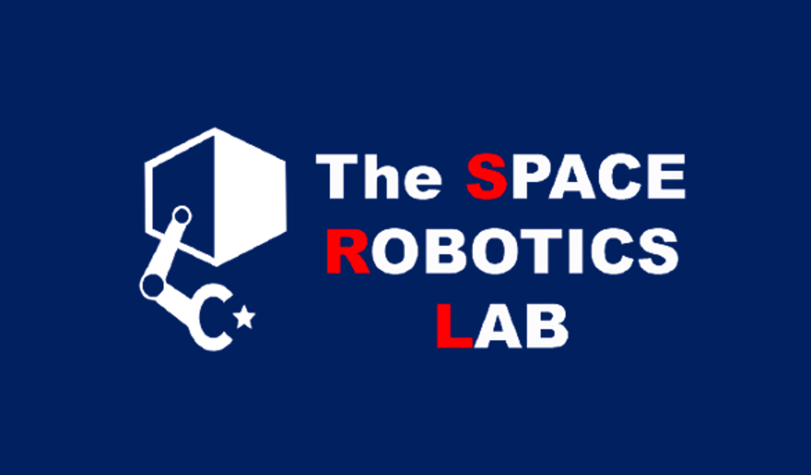

# 経歴

<!--  -->

## 職歴
* 2021年10月 ～ 現在　東北大学　大学院工学研究科　航空宇宙工学専攻　助教 （所属：[宇宙探査工学分野「宇宙ロボット研究室」](http://www.astro.mech.tohoku.ac.jp/index.html)）

  ### 担当講義（東北大学）
  - 2022年04月 ～ 現在　機械知能・航空実験Ⅰ：工学部 機械知能・航空工学科3年生
  - 2021年10月 ～ 現在　機械知能・航空研修Ⅰ（研究室分担）：工学部 機械知能・航空工学科2年生
  - 2021年10月 ～ 現在　機械知能・航空研修Ⅱ（研究室分担）：工学部 機械知能・航空工学科3年生
  - 2021年10月 ～ 現在　創造工学研修（研究室分担）：工学部1年生

* 2019年11月 ～ 2020年10月　ETH Zurich (Zürich, Switzerland), Department of Mechanical and Process Engineering, Institute of Robotics and Intelligent Systems, 学術研究員

* 2019年04月 ～ 2021年09月　独立行政法人 日本学術振興会 特別研究員DC1

* 2018年07月 ～ 2019年03月　[株式会社ispace](https://ispace-inc.com/jpn/) ソフトウェアエンジニアインターン

## 学歴
* 2018年10月 ～ 2021年09月　東北大学大学院　工学研究科　航空宇宙工学専攻　博士課程後期3年の課程（博士課程）
  
  博士論文題目: "Autonomous Limbed Climbing Robots for Challenging Terrain Exploration（挑戦的地形探査のための自律脚型クライミングロボット）"，GPA: 4.00/4.00

* 2016年10月 ～ 2018年09月　東北大学大学院　工学研究科　航空宇宙工学専攻　博士課程前期2年の課程（修士課程）
  
  修士論文題目: "フリークライミングロボットのための把持力を考慮した歩容計画"，GPA: 4.00/4.00

* 2013年04月 ～ 2016年09月　東北大学工学部　機械知能・航空工学科

  卒業論文題目: "月面探査マイクロローバのためのToFカメラの性能評価"，GPA: 3.39/4.00

* 2010年04月 ～ 2013年03月　北海道札幌南高等学校

## 研究業績

* これまでの研究業績は [こちら](pub_j.html)

* Google Scholar Citationsは [こちら](https://scholar.google.com/citations?view_op=list_works&hl=ja&user=kiw1NAUAAAAJ)

* SCOPUSは [こちら](https://www.scopus.com/authid/detail.uri?authorId=57208746798)

* researchmap [こちら](https://researchmap.jp/unoken)

## 特許

* 加藤 匠哉，宇野 健太朗，“把持機構”，国際特願PCT/JP2022/021947，出願日：2022年5月30日．

## 研究助成等

* 2019年04月 ～ 2022年03月　科学研究費助成事業（科研費）特別研究員奨励費
  
  研究課題名："[地形情報とグリッパの力学にもとづくフリークライミングロボットの自律制御原理の開拓](https://kaken.nii.ac.jp/grant/KAKENHI-PROJECT-19J20685/)"

* 2018年10月 ～ 2021年09月　東北大学 [機械科学技術国際共同大学院](http://www.spss.or.jp/support/ryohi.html)

* 2018年04月　公益財団法人 宇宙科学振興会 研究者支援 国際学会出席旅費支援

## 受賞歴

* 2022年01月　若手奨励賞優秀賞，日本航空宇宙学会 （第65回宇宙科学技術連合講演会において）

* 2021年09月　The 24th International Conference on Climbing and Walking Robots and the Support Technologies for Mobile Machines (CLAWAR), The Highly Commended Paper, 2021. (For the excellent paper in the conference) 

* 2020年03月　計測自動制御学会 東北支部 優秀発表奨励賞（第328回計測自動制御学会東北支部研究集会において）

* 2019年03月　[日本機械学会 三浦賞](https://www.jsme.or.jp/event_project/award/miura-award)（日本国内の大学院機械工学系の当該年度修了者で，人格，学業ともに最も優秀である と認められた者）

## メディア出演・掲載など

* 2021年04月20日【TV出演】東北大　世界をリードする宇宙研究　月面探査ロボット＆帰還型人工衛星開発，チャージ！（khb東日本放送）．

* 2021年02月25日【TV出演】ミヤギ news every. (ミヤギテレビ)．（月面探査ロッククライミングロボットの研究開発を紹介）

* 2021年11月21日【新聞掲載】[未来をつくる科学の力（１）宇宙探査ロボット開発，河北新報社　こども新聞](https://kahoku.news/articles/20211122khn000012.html)．

* 2021年02月26日【Webメディア出演】 [東北大学 「震災 10年の知と未来事業」による第４回オンラインシンポジウム「探究と生きる」](https://www.youtube.com/watch?v=aUklRM_V4x8)，東北大学．（ドキュメンタリー 内にて研究プロジェクト紹介）

* 2017年08月27日【雑誌掲載】日本の大学における早期卒業制度に関して体験をもとに紹介，[朝日新聞出版AERA](https://dot.asahi.com/aera/2017082400063.html?page=1)．

* 2017年03月01日【TV出演】1億人の大質問！？笑ってコラえて！（日本テレビ）．（月面探査ローバーの研究開発を紹介）

## その他の活動

* 2022年04月04日　Guest lecturer for "Space Robotics Training Programme" organized by Spacenova, India.

* 2022年01月25日　札幌市立中央中学校　総合的な学習の時間（学外講師として授業参加）

## 共同研究先

* Robotics Systems Lab., Department of Mechanical and Process Engineering,ETH Zurich (Zürich, Switzerland)

* JAXA 有人宇宙技術部門 有人宇宙技術センター

* 川崎重工業株式会社

## 所属学会

* 日本機械学会

* 日本航空宇宙学会

* 日本計測自動制御学会

* IEEE

## [Back to Top Page](./)
