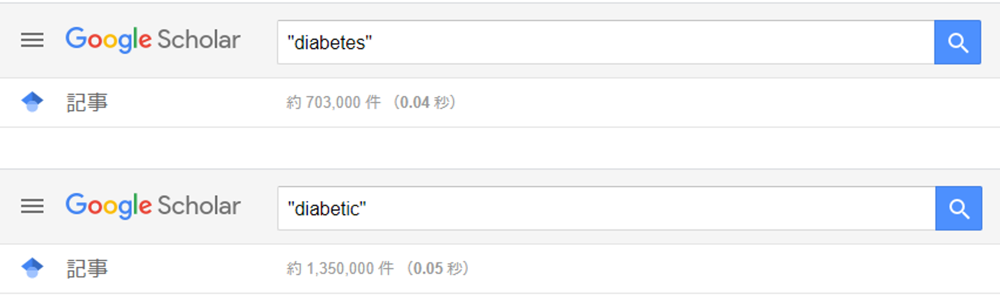
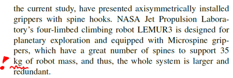
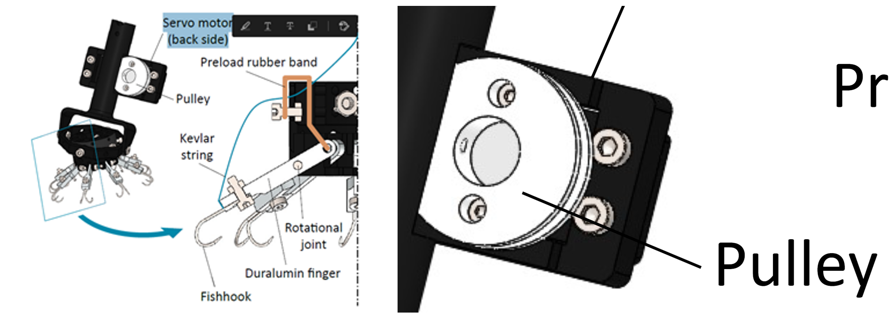
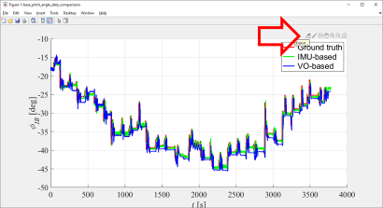
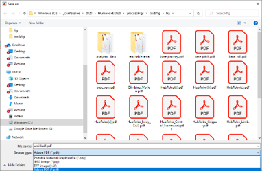
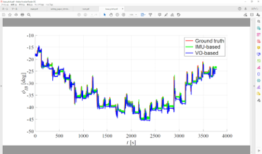

# ノート

## 学術的文書の執筆方法（Tool, Tips）

大学や大学院，そしてその先の企業や研究機関で働く研究者として，学術論文の執筆は日々行う活動の一つであるが，これまで自分が論文執筆をしていく中で便利・重要であると学んだ事項についてまとめる．

下記，自分が大学院生時代に他の研究室メンバー向けに作成した文書の内容である．

また，学術文書を書くにあたってLaTeXを使用する場合，筆者が査読作業に関わった下記の書籍をおすすめしたい．特に初心者にむけてLaTeXの環境構築から使用方法について非常に丁寧に書かれた良い入門書である．

* 明松真司 氏 著　「<a href="https://amzn.asia/d/do3nRd7" target="_blank">1週間でLaTeXの基礎が学べる本</a>」

## Introduction
This document instructs the fundamentals to write good academic documents such as thesis, technical report, and journal or conference proceedings in LaTeX. 

### Useful Tools
In most cases, you are supposed to use LaTeX to output the high quality document. However, to make the sentences before compiling with LaTeX, there are some useful tools. The author summarizes them in this chapter.

#### Writing tools 

In this section, some useful tools to write good sentences in English are summarized.

- #### Microsoft Word

    I believe the MS Word is the best tool to write a good sentence especially if you write in English because it is equipped with the internal Thesaurus dictionary, which can suggest some grammatical correction or alternative synonyms while you are writing.

    To use the dictionary, you should do the following steps: 1) select the word 2) wirht click, and 3) click the “synonym.”

    So, I recommend using 1) MS Word for the writing and revision phase in your work, and after completion of the sentences, 2) you can copy them into your LaTeX editor and next add some commands for including figures, tables, equations, etc.

- #### Google Scholar

    This is the Google extension web service to search academic articles on the Internet.

    You can add the Google Scholar extension button in your chrome browser.

    You can use the exact match search to investigate how common your expression is in the research field. Example case is shown in Fig. 1. 

    
    
    Fig. 1. The total hit number when you search “diabetic (糖尿病)” (top) and “diabetes” (bottom) with the use of the Google Scholar exact match search. In this case, the word “diabetes” is more widely used in the academic field. 

    If you search the specific word with the double quotations, Google returns how many academic documents also use that expression. 

- #### Grammarly

    Grammarly is the free software that corrects grammatical miss-writing and miss-spelling.

    You can use Grammarly service as a basic grammatical correction. 
    
    > NOTE: Grammarly correction sometimes does not make sense, so you cannot rely on that too much. In addition, since DeepL is so intelligent that it translates even the incomplete sentences into the natural phrases, you cannot use DeepL for the grammatical check.
    

- #### DeepL

    DeepL is the free software that translates between multiple languages, which is usually used for academic paper reading.

    You can use DeepL to check whether your logic is correct. If DeepL translates your English into your mother language successfully more or less, you can believe the context is correct. 

- #### ChatGPT

    I recommend you to use ChatGPT to revise your text (Not recommending using it as a "ghost writer"!).You can ask simply ”Please revise this text for academic journal publication." and paste your draft. ChatGPT is also useful to revise your text and correct any typo and gramatical errors. 

#### Illustrating tools

Some illustrating tools help you with making great figures easily.

- #### Microsoft Powerpoint

    MS Powerpoint is one of the most ordinary and useful tools to produce academic quality figures.

    You can make some figures, and save the figure that you made as the independent file just press the button “save as figure” by right clicking.

- #### Inkscape

    Inkscape is a free software to handle a variety of figure files. It covers a lot of types such as: .jpg, .png, .pdf, .eps, .sgv, and more.

- #### Matlab

    To make the great quality of the plot, Matlab is the best tool. You can produce the figure that you made as a vector file by clicking the “export” mark in your .fig file.

- #### mathpix

    mathpix is the free platform to convert an image of the equation to the possible LaTeX code. You should try to use it to save the time to program on your own

### Writing Tips (Particularly in LaTeX)

In this chapter, important points that should be taken into account when you write an academic paper. 

Although the following points are really basic, not a few students tend to miss them if they do not keep in mind them. This document wraps up the issues that students often mistake. 

1. Distinguish between variables and constants

    - As a rule, variables should be written in italic, and constants should be in Roman (non italic),

2. Distinguish between vector and scalar variables.

    - In general, vector variables can be written in bold, but scalar in non bold.

    - Carefully select the shape depending on the meanings of the variables.

3. The unit cannot come to the beginning of the line. 

    - The example of this violation is shown in Fig. 2.

    - To avoid this issue in LaTeX, you should simply put “~” between the value and the unit, so that LaTeX recognizes them as one single word. (E.g. 9.0~N)

    

    Fig. 2. The example that the unit is put at the beginning of the line in a sentence.This is not allowed in the academic document.

4. The number of the Figure, Table, or Equation cannot come to the beginning of the line samely as 3.

    - To avoid this issue in LaTeX, you should also simply put “~” between the “Fig.” and the number, so that LaTeX recognizes them as one single word. (E. g. Fig.~\ref{fig:XXXXXX})

    - However, in the most cases, \fig command is defined in the preambles such like “\newcommand{\fig}[1]{Fig.~\ref{#1}}” of LaTeX, so you should check the definition.

5. Refer to every figure, table, equation, and reference in your paper if you put it. **You cannot put any visual materials if you do not cite them.**

6. Use “en-dash” instead of hyphen to export longer horizontal lines

    - En-dash should be used to express “duration” such as the pages.

    - To export en-dash in LaTeX, you should simply put hyphen twice in a row. E.g., pp. 398--403 (NOT pp. 398-403).

### Figure Export

In this chapter, I will instruct the steps to export the figures based on the experience. I believe this way is one of the best ways to make good figures. Also, it is important to know the type of the figures, which is raster or vector, and choose the appropriate one. The following are the brief summary of the type of the figure file.

#### 1. Raster file: 

    - The basic file type for the image and picture. Basically, this expresses the image by dots.

    - So, if you zoom up the file that resolution if not high, the image becomes blocky as shown in Fig. 3. 

    - Therefore, if you use a raster file, you should be careful to make the image have sufficient resolution. 

    - Example of file extension: ****.JPG, ****.PNG, ****.BMP

    - Usually, a photo, picture, and  image should be saved as a raster file. 

    - For LaTeX compilation, .JPG or .BMP is the best format, however, .PNG is also includable if you set the appropriate preamble.

    

    Fig. 3. The raster image which resolution is too low to show (left) and the same image that has a sufficient resolution (right).

#### 2. Vector file:

    - The other file type of figure. This file type expresses the figure by multiple shapes, real texts, and raster images.

    - So, even if you zoom up the file, the embedded shapes and texts do not become blocky because they are recognized as they are. Some advantages of vector graphics are shown in Fig.4.

    - Example of file extension: ****.PDF, ****.EPS, ****.SVG

    - Usually, a conceptual diagram, graph, and other image with the text should be saved as a vector file. 

    - For LaTeX compilation, .PDF is the best format, however, .EPS is also includable if you set the appropriate preamble.

    

    Fig. 4. An example of a vector file. For instance, you can select the embedded characters as a text (left). Also, an embedded line and text does not become blocky even though they are zoomed up while the background CAD image becomes slightly blocky (right). 

Now you understand the type of the figure and are ready to see the specific technique to export the figures.

#### Graphs Export

As I mentioned before, the best tool to export the graph is Matlab. The way to export your Matlab graph as a vector file is simple as follows:

> NOTE: the following instruction assumes your Matlab version is higher than 2013b.

1. Make your plot by Matlab.

2. Click “export”

3. Pull down to select the file extension and save it as .pdf file

4. Finally the graph is saved as a pdf file. 

> NOTE: Actually you can save the graph as vector files by just using “Save As,” but in this procedure, some fonts are often strangely converted and sometimes the file can be broken. So I definitely recommend making the vector file in the above solution. I have not experienced any problem in the solution I suggest so far. 

#### Handmade Figures Export

To be added ...  

## [その他に戻る](./etc_j.html)

## [Back to Top Page](./)