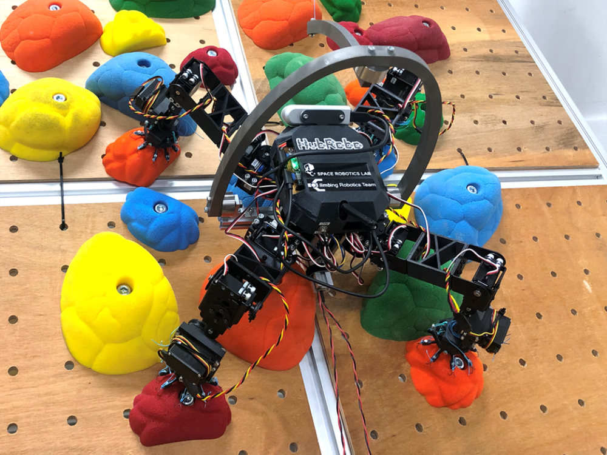
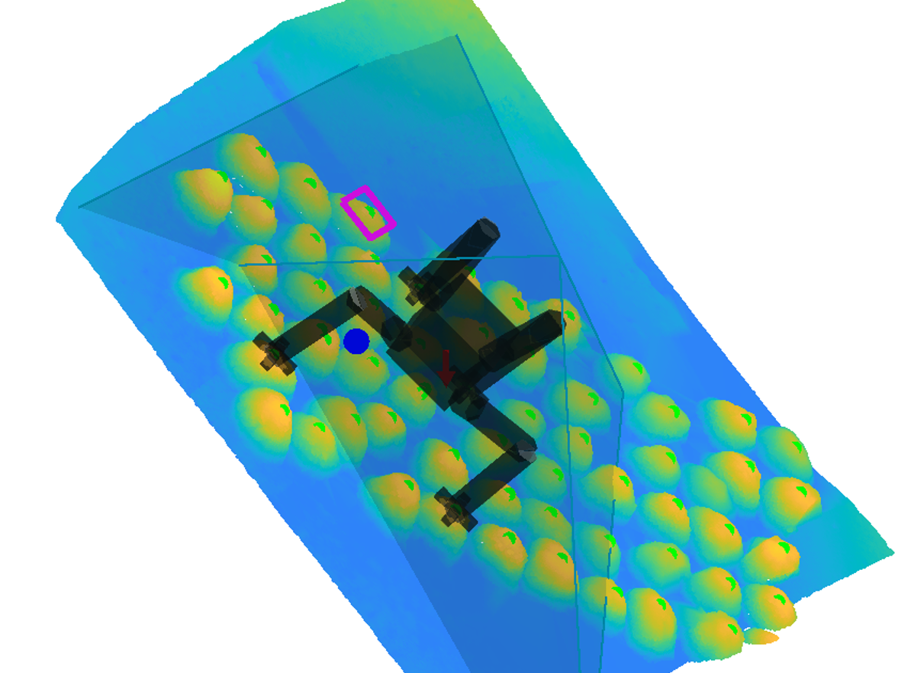

# Projects

## Research projects

I am interested in the field and service robotics in the extreme environment. The followings are the main projects that I have been performing. Each detailed page will be updated soon...

## Legged Climbing Robotics

For exploring the steep and irregular terrain represented as an outcrop, cliff wall, cave ceiling, and Lunar and Martian lava tube, the legged robot equipped with the gripping mechanism, called <I>limbed climbing robot</I> is to be the innovative strategy to expand the traversable areas by a mobile robot. For the future advanced exploration mission, this research and development project tackles the challenge to realize the autonomous limbed robot's climbing locomotion.

### HubRobo: Quadrupedal Climbing Robot Testbed

### ClimbLab: MATLAB Simulation Platform for Legged Climbing Robotics

### Terrain-, Inclination-, and Gravity-Adjustable Testfield

## Lunar/Planetary Exploration Rover

Wheeled robotic exploration on the planetary surface needs an innovation in terms of the efficiency and locomotion speed for advanced mission.

### Qualification and Implementation of Time-of-Flight Camera for Space Exploration Microrover

## [back](./)
