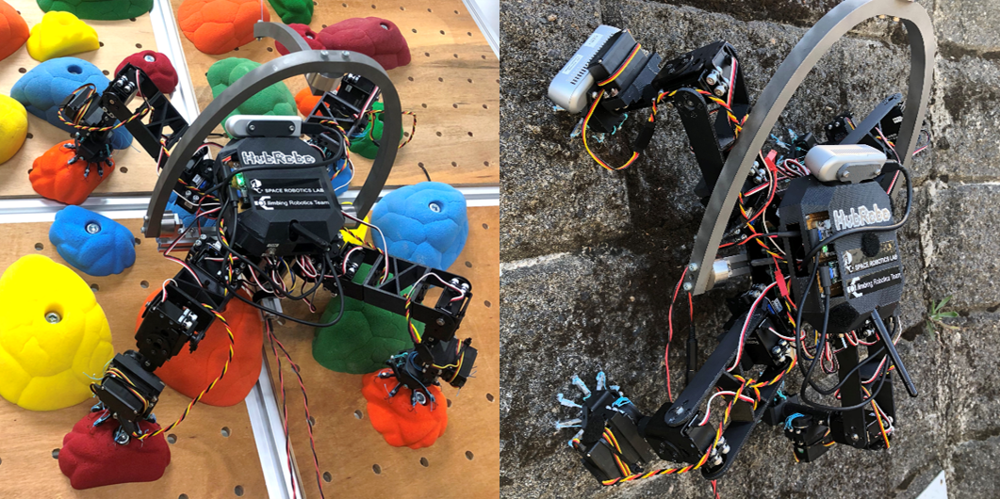
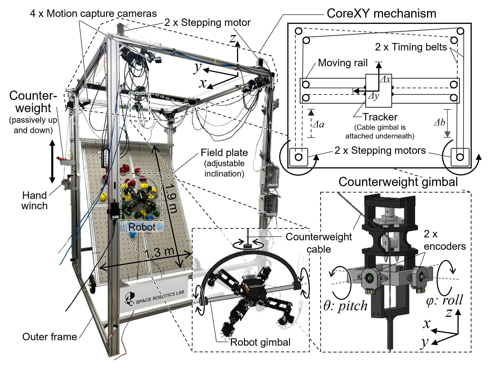
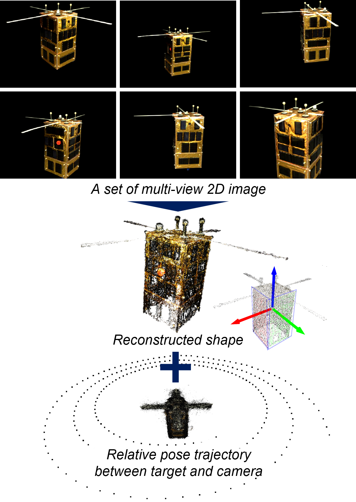

# Projects

I am interested in the field and service robotics in the extreme environment. The followings are the main projects that I have been performing. Each detailed page will be updated soon...

## Lunar/Planetary Exploration Rover

Wheeled robotic exploration on planetary surfaces needs an innovation in terms of the efficiency and locomotion speed for advanced mission. Increse of the ratio of the on-board autonomization (sensing, mapping, localization, online path planning, and navigation) is the essential mission.

### Qualification and Implementation of Time-of-Flight Camera for Space Exploration Microrover

<center>
 
</center>


- ToF (Time-of-Flight) has not been the space-grade technology. However, optical and software filtering 
enables to be robust under the direct sunlight illumination.

- Related publication is below:

- Major publication(s) related to this work is as follows:

  ```
  @article{kentaroUno2018,
    title={Qualification of a Time-of-Flight Camera as a Hazard Detection and Avoidance Sensor for a Moon Exploration Microrover},
    author={Kentaro UNO and Louis-Jerome BURTZ and Marc HULCELLE and Kazuya YOSHIDA},
    journal={TRANSACTIONS OF THE JAPAN SOCIETY FOR AERONAUTICAL AND SPACE SCIENCES, AEROSPACE TECHNOLOGY JAPAN},
    volume={16},
    number={7},
    pages={619--627},
    year={2018},
    doi={10.2322/tastj.16.619}
  }
  ```

### High-Speed and High-Traversability Rover Testbed

<!-- <div class="image_mouseover_1">  -->
 
<!-- </div> -->
<!--  -->


  ```
  @article{10325569,
    author={Rodríguez-Martínez, David and Uno, Kentaro and Sawa, Kenta and Uda, Masahiro and Kudo, Gen and Diaz, Gustavo Hernan and Umemura, Ayumi and Santra, Shreya and Yoshida, Kazuya},
    journal={IEEE Robotics and Automation Letters}, 
    title={Enabling Faster Locomotion of Planetary Rovers With a Mechanically-Hybrid Suspension}, 
    year={2024},
    volume={9},
    number={1},
    pages={619-626},
    keywords={Moon;Wheels;Robots;Space vehicles;Mobile robots;Shock absorbers;Gravity;Compliant joints and mechanisms;mechanism design;space robotics and automation},
    doi={10.1109/LRA.2023.3335769}}
  ```

  - **Please watch the **<a href="https://youtu.be/usZFhx5iGGY" target="_blank">[YouTube Video]</a>** indroducing our high-speed rover testbed EX1.**

## Legged Climbing Robotics

For exploring the steep and irregular terrain represented as an outcrop, cliff wall, cave ceiling, and Lunar and Martian lava tube, the legged robot equipped with the gripping mechanism, called _limbed climbing robot_ is to be the innovative strategy to expand the traversable areas by a mobile robot. For the future advanced exploration mission, this research and development project tackles the challenge to realize the autonomous limbed robot's climbing locomotion.

### HubRobo: Quadrupedal Climbing Robot Testbed
<!--  -->


-  HubRobo is a couple kg class ground-gripping legged mobile robot platform aimed to be deployed for exploration, inspection, monitoring and so on in harsh environment. 
- Highly energy-efficient, miniaturized, and strong passive spine grippers are installed at the tip of the each foot, which allow it to climb up rocky uneven slope.
- **Please watch the [YouTube video](https://www.youtube.com/watch?v=CZyJCvOKx9A) indroducing HubRobo.**
- Major publication(s) related to this work is as follows:

  ```
  @inproceedings{uno2021hubrobo,
    title={HubRobo: A Lightweight Multi-Limbed Climbing Robot for Exploration in Challenging Terrain},
    author={Kentaro Uno and Naomasa Takada and Taku Okawara and Keigo Haji and Arthur Candalot and Warley F. R. Ribeiro and Kenji Nagaoka and Kazuya Yoshida},
    booktitle={Proceedings of the IEEE-RAS International Conference on Humanoid Robots (Humanoids)},
    pages={209--215},
    year={2021}
  }
  ```

### ClimbLab: MATLAB Simulation Platform for Legged Climbing Robotics


| Slope climbing | Path planning | Foothold planning |
|-------------|---------------|---------------|
|  |  |  |

- ClimbLab is a MATLAB simulator for the articulated robotics system particularly for climbing application.

- This simulator wraps up functions for:

  ☑ Dynamic analysis and simulation of articulated multi-body systems with a floating base (*This is performed by [SpaceDyn](https://github.com/Space-Robotics-Laboratory/SpaceDyn)*)

  ☑ Design of legged robotic system

  ☑ Environment demonstration (different terrain shape, inclination, and gravity)

  ☑ Visualization (Robot, map, support polygons, stability criterion, and time-history of any state variables) 

- **ClimbLab is an open-sourced simulator. See the [GitHub page](https://github.com/Space-Robotics-Laboratory/ClimbLab).**

- Major publication(s) related to this work is as follows:

  ```
  @inproceedings{uno2021climblab,
    title={ClimbLab: MATLAB Simulation Platform for Legged Climbing Robotics},
    author={Kentaro Uno and Warley F. R. Ribeiro and Yusuke Koizumi and Keigo Haji and Koki Kurihara and William Jones and Kazuya Yoshida},
    booktitle={Robotics for Sustainable Future: Proceedings of the 24th International Conference Series on Climbing and Walking Robots and the Support Technologies for Mobile Machines (CLAWAR) 2021},
    pages={179--191},
    year={2021}
  }
  ```

- **Please watch the [YouTube video](https://www.youtube.com/watch?v=nNB8uTTsJJg)** (presented in CLAWAR conference) for more information!

### Terrain-, Inclination-, and Gravity-Adjustable Testfield
- We can arrange any environment for the climbing robot's experiment.



  ```
  @inproceedings{uno2024lower,
    title={Lower Gravity Demonstratable Testbed for Space Mobile Robot Experiments},
    author={Kentaro Uno and Kazuki Takada and Keita Nagaoka and Takuya Kato and Arthur Candalot and Kazuya Yoshida},
    booktitle={Proceedings of the IEEE/SICE  International Symposium on System Integration (SII)},
    pages={484--485},
    year={2024}
  }
  ```

- **Please watch the <a href="https://youtu.be/beSt5cv2d0g" target="_blank">[YouTube Video]</a>** for more information!

<!-- ### Mobile Manipulator in Microgravity 


- International Space Station -->

### Sensorized Spined Gripper


## Robotic Active Debris Removal in Orbit

Active Debris Removal (ADR) is the essential theme towards the sustainable orbital activity.

... (detail information still under constuction) ...

### Structure-from-Motion-based Spacecraft Pose Estimation

