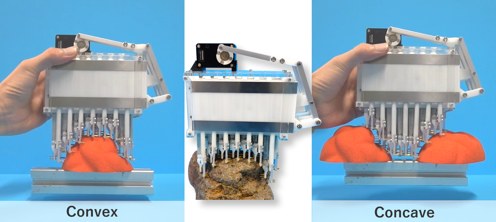
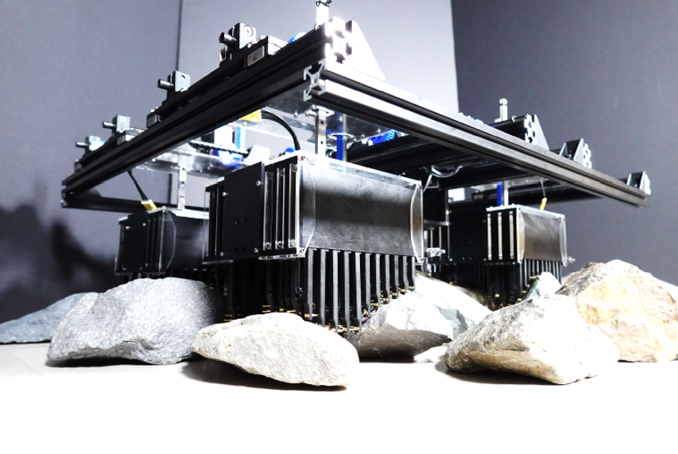

# [ピン配列型把持機構](./proj_pinarray.html)

## ピン配列型把持機構の開発 **<a href="https://youtu.be/dWo28Nl5jgE?feature=shared" target="_blank">  </a>**



### 概要

- ピン配列型把持機構は地形の凹形状と凸形状の両方を把持可能な画期的なグリッパである．

- 事前のセンシングを必要とせずに，地形に押し付けて単一のアクチュエータを駆動させるだけで凹と凸の両方の形状を掴むことが可能である．

- また，ピンの沈み込み量を計測することで，ハプティックに地形形状をセンシングすることも可能である．

- ピン先の素材等を変更することで，硬いものと柔らかいものの両方を把持可能である．

  （例）

  - 爪を装備することで岩石のような表面がざらざらしたような剛体を強固に把持可能である．
  
  - ピン先に柔軟部材を用いることで野菜や果物など柔らかい不定形状の物体を把持することが可能である．

### 動画

- 本研究成果に関する動画として下記をご覧ください．

    - <a href="https://youtu.be/uEP9wexJkyE?feature=shared" target="_blank"> 「さまざまな凹凸形状をつかめるピン配列型把持機構」</a>（2023年7月11日，<a href="https://shingi.jst.go.jp/list/list_2023/2023_tohoku.html#20230711X-001" target="_blank">東北大学 新技術説明会</a>にて） 

    - <a href="https://youtu.be/dWo28Nl5jgE?feature=shared" target="_blank">  A Pin-Array Structure for Gripping and Shape Recognition of Convex and Concave Terrain Profiles </a>


### 成果

- 本成果に関する主要論文は下記になります．

  ```
  @@INPROCEEDINGS{10011858,
    author={Kato, Takuya and Uno, Kentaro and Yoshida, Kazuya},
    booktitle={2022 IEEE International Conference on Robotics and Biomimetics (ROBIO)}, 
    title={A Pin-Array Structure for Gripping and Shape Recognition of Convex and Concave Terrain Profiles}, 
    year={2022},
    volume={},
    number={},
    pages={1365-1370},
    keywords={Three-dimensional displays;Shape;Shape measurement;Prototypes;Grasping;Terrain mapping;Vision sensors},
    doi={10.1109/ROBIO55434.2022.10011858}}
  }
  ```

  ```
  @article{加藤匠哉2024ピン配列型凹凸地形把持機構,
    title={ピン配列型凹凸地形把持機構},
    author={加藤匠哉 and 宇野健太朗 and 吉田和哉},
    journal={日本ロボット学会誌},
    volume={42},
    number={2},
    pages={177--180},
    year={2024},
    publisher={一般社団法人 日本ロボット学会}
  }
  ```
- 本成果に関する特許情報は下記になります．

  加藤 匠哉，宇野 健太朗，“把持機構、ロボット”，公開番号WO/2023/233468，国際出願番号PCT/JP2022/021947，国際出願日2022年5月30日．

## ピン配列型把持機構を応用したクライミングロボットの研究開発

 


<center> <a href="https://jka-cycle.jp" target="_blank"></a> <a href="http://keirin.jp/pc/top" target="_blank"></a> </center>

### 概要

　ピン配列型把持機構を発展させた本研究では，ピン配列把持機構を小型化・高性能化し，要素として複数組み合わせた移動体を実現することで，崖や洞窟壁面，瓦礫地帯などの不整地表面でも安定して自在にクライミング移動可能なロボットシステムを創出することを目的としています．本研究成果は，地質調査や宇宙探査用移動ロボットという科学的利用価値と，災害現場での救助活動支援や環境モニタリング業務の代替といった近未来のロボット社会実現に向けた社会的利用価値が見込まれます．

　なお，本研究は競輪の補助を受けて実施しています．

### 動画

　今後，論文採択と同時にYouTubeに動画をアップロードしてゆく予定です．

### 成果

- 本成果に関する主要論文は下記になります．

  ```
  @article{加藤匠哉2024複数のピン配列型把持モジュールによる崖登りロボットの開発,
    title={複数のピン配列型把持モジュールによる崖登りロボットの開発},
    author={加藤匠哉 and 宇野健太朗 and 吉田和哉},
    journal={自律分散システム・シンポジウム},
    volume={},
    number={},
    pages={},
    year={2023},
  }
  ```

    長岡佳汰，宇野健太朗，吉田和哉，“ピン配列型把持機構を応用したクライミングロボットの実証実験”，第42回 日本ロボット学会誌，大阪，2024年．※発表予定
