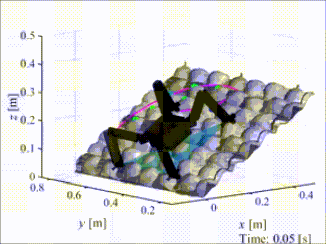

#  プロジェクト 

日本語のページはただいま準備中です．運用開始まで，[英語のページ](./proj.html)をご覧ください．

<!-- 
I am interested in the field and service robotics in the extreme environment. The followings are the main projects that I have been performing. Each detailed page will be updated soon...

# Lunar/Planetary Exploration Rover

Wheeled robotic exploration on planetary surfaces needs an innovation in terms of the efficiency and locomotion speed for advanced mission. Increse of the ratio of the on-board autonomization (sensing, mapping, localization, online path planning, and navigation) is the essential mission.

## Qualification and Implementation of Time-of-Flight Camera for Space Exploration Microrover

- ToF (Time-of-Flight) has not been the space-grade technology. However, optical and software filtering 
enables to be robust under the direct sunlight illumination.

## High-Speed and High-Traversability Rover Testbed

# Legged Climbing Robotics

For exploring the steep and irregular terrain represented as an outcrop, cliff wall, cave ceiling, and Lunar and Martian lava tube, the legged robot equipped with the gripping mechanism, called <I>limbed climbing robot</I> is to be the innovative strategy to expand the traversable areas by a mobile robot. For the future advanced exploration mission, this research and development project tackles the challenge to realize the autonomous limbed robot's climbing locomotion.

## HubRobo: Quadrupedal Climbing Robot Testbed

-  HubRobo is a couple kg class ground-gripping legged mobile robot platform aimed to be deployed for exploration, inspection, monitoring and so on in harsh environment. 
- Highly energy-efficient, miniaturized, and strong passive spine grippers are installed at the tip of the each foot, which allow it to climb up rocky uneven slope.
- **Please watch the [YouTube video](https://www.youtube.com/embed/hK9ax_vVjNc) indroducing HubRobo.**

## ClimbLab: MATLAB Simulation Platform for Legged Climbing Robotics

| Slope climbing | Path planning | Foothold planning |
|-------------|---------------|---------------|
|  |  |  |

- ClimbLab is a MATLAB simulator for the articulated robotics system particularly for climbing application.

- This simulator wraps up functions for:

  ☑ Dynamic analysis and simulation of articulated multi-body systems with a floating base (*This is performed by [SpaceDyn](https://github.com/Space-Robotics-Laboratory/SpaceDyn)*)

  ☑ Design of legged robotic system

  ☑ Environment demonstration (different terrain shape, inclination, and gravity)

  ☑ Visualization (Robot, map, support polygons, stability criterion, and time-history of any state variables) 

- **ClimbLab is an open-sourced simulator. See the [GitHub page](https://github.com/Space-Robotics-Laboratory/ClimbLab).**

## Terrain-, Inclination-, and Gravity-Adjustable Testfield
- We can arrange any environment for the climbing robot's experiment.

<!-- ### Mobile Manipulator in Microgravity 

- International Space Station -->

<!-- ## Sensorized Spined Gripper

# Robotic Active Debris Removal in Orbit

Active Debris Removal (ADR) is the essential theme towards the sustainable orbital activity.

... (detail information still under constuction) ...

## Structure-from-Motion-based Spacecraft Pose Estimation
  -->

## [Back to Top Page](./)
