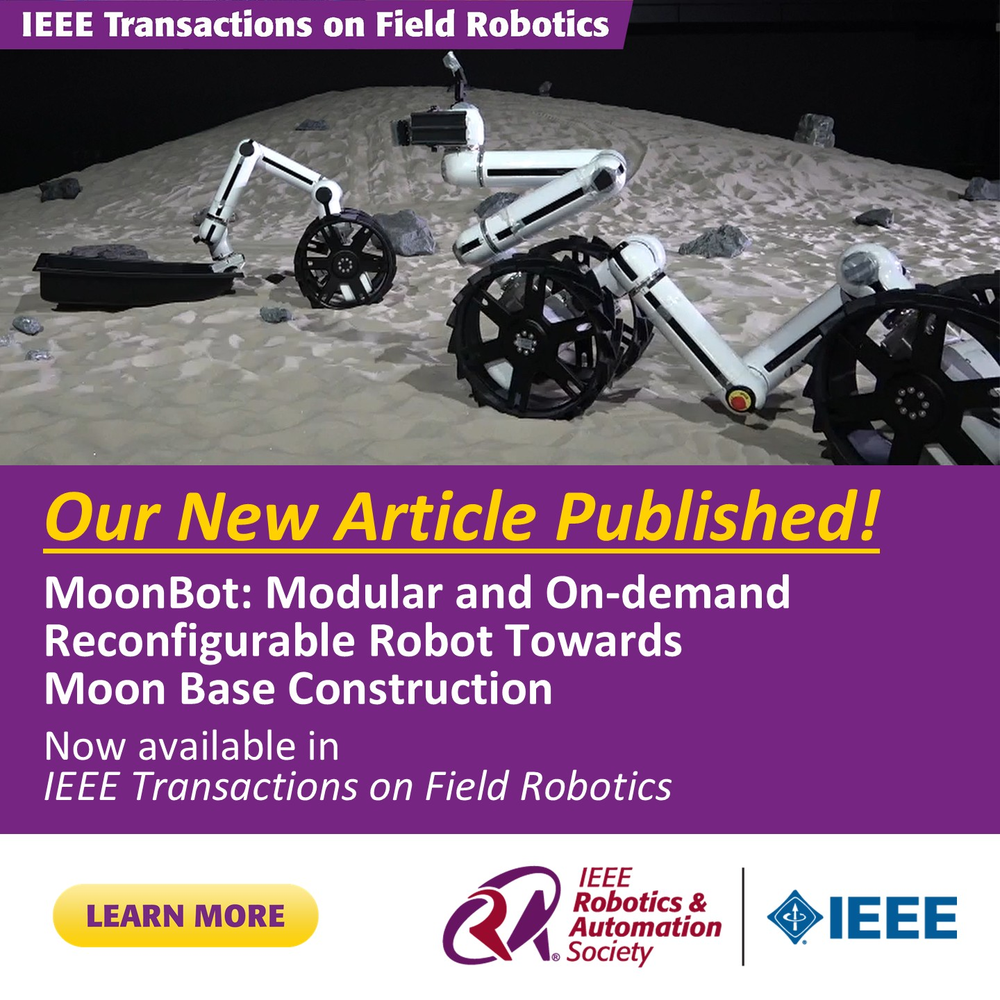

<!-- @TODO: wanting to use [link](url){:target="_blank"} to open the link in another tab -->

# 論文業績

* Google Scholar Citationsは <a href="https://scholar.google.com/citations?view_op=list_works&hl=ja&user=kiw1NAUAAAAJ" target="_blank">こちら > </a>
 

* SCOPUSは <a href="https://www.scopus.com/authid/detail.uri?authorId=57208746798" target="_blank">こちら > </a>

* researchmapは <a href="https://researchmap.jp/unoken" target="_blank">こちら > </a>
 

## 動画

* 動画によるこれまでの研究紹介は <a href="https://www.youtube.com/@spaceroboticslab" target="_blank"> Space Robotics Lab. YouTube Channel </a> をご覧ください．

    

      <iframe src="https://www.youtube.com/embed/Qe7Tijo615M" allowfullscreen></iframe>
    

    

Innovative Space Technology | Tohoku University Cross-Technology Initiative for Space Systems

<!-- * Please check out the new video: <a href="https://youtube.com/clip/UgkxbamwZ4lclz6GydVxNQ02B7oVr5DFFxqs?si=jB3nxPy1GWtdvJvF" target="_blank"> Tohoku University Cross-Technology Initiative for Space Systems</a>. -->

## 学術誌論文

  

15. **Kentaro Uno**\*, Elian Neppel\*, Gustavo H. Diaz\*, Ashutosh Mishra\*, Shamistan Karimov\*, A. Sejal Jain, Ayesha Habib, Pascal Pama, Hazal Gozbasi, Shreya Santra, Kazuya Yoshida, "<a href="https://doi.org/10.1109/TFR.2025.3624346" target="_blank">MoonBot: Modular and On-Demand Reconfigurable Robot Toward Moon Base Construction</a>," _IEEE Transactions on Field Robotics_, vol. 2, pp. 847--874, <a href="https://doi.org/10.1109/LRA.2025.3580332" target="_blank">DOI: 10.1109/TFR.2025.3624346</a>, 2025. \*These authors contributed equally.
 

 

14. Keisuke Takehana, Grace Kenny, Kenta Sawa, James Hurrell, **Kentaro Uno**, Shreya Santra, Kazuya Yoshida, "<a href="https://doi.org/10.1016/j.jterra.2025.101084" target="_blank">Grouser Wheel High-Speed Traction Performance: DEM Simulation and Experimental Result</a>," _Journal of Terramechanics_, vol. 120, p. 101084, 2025.

13. Taku Okawara, Kenji Koide, Aoki Takanose, Shuji Oishi, Masashi Yokozuka, **Kentaro Uno**, Kazuya Yoshida, "<a href="https://ieeexplore.ieee.org/document/11037541" target="_blank">Tightly-Coupled LiDAR-IMU-Leg Odometry with Online Learned Leg Kinematics Incorporating Foot Tactile Information</a>," _IEEE Robotics and Automation Letters (IEEE RA-L)_, vol. 10, no. 8, pp. 7947--7954, <a href="https://doi.org/10.1109/LRA.2025.3580332" target="_blank">DOI: 10.1109/LRA.2025.3580332</a>, 2025. 
 

12. James Hurrell, Keisuke Takehana, Tomomi Tanaka, **Kentaro Uno**, Amna Khalifa Busoud, Kazuya Yoshida, "<a href="https://link.springer.com/article/10.1007/s11214-025-01164-8" target="_blank">Traction Performance Evaluation for a Rashid-1 Rover Wheel</a>," _Space Science Review_, vol. 221, no. 3, pp. 1--16, <a href="https://doi.org/10.1007/s11214-025-01164-8" target="_blank">DOI: 10.1007/s11214-025-01164-8</a>, 2025.

11. Taku Okawara, Kenji Koide, Shuji Oishi, Masashi Yokozuka, Atsuhiko Banno, **Kentaro Uno**, Kazuya Yoshida, "<a href="https://www.sciencedirect.com/science/article/pii/S0921889025000156?via%3Dihub" target="_blank">Tightly-coupled LiDAR-IMU-wheel odometry with an online neural kinematic model learning via factor graph optimization</a>," _Robotics and Autonomous Systems_, volume 187, no. 0921-8890, p. 104929, <a href="https://doi.org/10.1016/j.robot.2025.104929" target="_blank">DOI: 10.1016/j.robot.2025.104929</a>, 2025.
 

10. Keisuke Takehana, Vinicius Emanoel Ares, Shreya Santra, **Kentaro Uno**, Eric Rohmer, and Kazuya Yoshida, "<a href="https://www.mdpi.com/2226-4310/12/1/71" target="_blank">Rutting Caused by Grouser Wheel of Planetary Rover in Single-Wheel Testbed: LiDAR Topographic Scanning and Analysis</a>," _Aerospace_, vol. 12, no. 1, 71, <a href="https://doi.org/10.3390/aerospace12010071" target="_blank">DOI: 10.3390/aerospace12010071</a>, 2025.

9. Keisuke Takehana, Shino Kizaki, Tomomi Tanaka, **Kentaro Uno**, and Kazuya Yoshida, "<a href="https://doi.org/10.1016/j.jterra.2024.101011" target="_blank">Comparison of Lunar Rover Wheel Performance in Soils with Different Cohesive Properties</a>," _Journal of Terramechanics_, vol. 117, p. 101011, 2025.

8. Taku Okawara, Kenji Koide, Shuji Oishi, Masashi Yokozuka, Atsuhiko Banno, **Kentaro Uno**, and Kazuya Yoshida, "<a href="https://ieeexplore.ieee.org/document/10681089" target="_blank">Tightly-Coupled LiDAR-IMU-Wheel Odometry with Online Calibration of a Kinematic Model for Skid-Steering Robots</a>," *IEEE Access*, vol. 12, pp. 134728--134738, 2024. 
 
  <!-- * Kenta Sawa, **Kentaro Uno**, Kohta Naoki, Masahiro Uda, Kazuya Yoshida, “<a href="https://www.rsj.or.jp/pub/jrsj/advpub/240124-04.html" target="_blank">Lunar Exploration Rover’s High-Speed Mobility Experiment in Moon Surface Analogue Test Field: "Lunar Terrace” in Tottori Sand Dunes</a>",” _Journal of the Robotics Society of Japan (JRSJ)_，vol. TBD, no. TBD, pp. TBD, 2024. (Accepted, in Japanese) -->

7. David Rodr´ıguez-Mart´ınez\*, **Kentaro Uno**\*, Kenta Sawa, Masahiro Uda, Gen Kudo, Gustavo Hernen Diaz, Ayumi Umemura, Shreya Santra, and Kazuya Yoshida, "<a href="https://ieeexplore.ieee.org/document/10325569" target="_blank">Enabling Faster Locomotion of Planetary Rovers with a Mechanically-Hybrid Suspension</a>," _IEEE Robotics and Automation Letters (IEEE RA-L)_, vol. 9, no. 1, pp. 619--626, <a href="https://doi.org/10.1109/LRA.2023.3335769" target="_blank">DOI: 10.1109/LRA.2023.3335769</a>, 2023. \*These authors contributed equally. (This work will be presented in IEEE ICRA 2024 @Yokohama) 
 
 

6. 宇田 昌弘, 澤 健太, **宇野 健太朗**, 加藤 匠哉, Li Zheng Travis Lim, 吉田 和哉, "<a href="https://www.rsj.or.jp/pub/jrsj/advpub/240124-04.html" target="_blank">車輪–グリッパ間変形可能機構の開発と把持性能評価</a>," _日本ロボット学会誌_，vol. 42, no. 6, pp. 580--583, 2023.

5. **宇野 健太朗**, Warley F. R. Ribeiro, 小泉 裕介, 永岡 健司, 吉田 和哉, "<a href="https://www.rsj.or.jp/pub/jrsj/advpub/231213-09.html" target="_blank">重力慣性加速度（GIA）を用いた脚型壁登りロボットの転倒安定性評価基準</a>,"_日本ロボット学会誌_，vol. 42, no. 3, pp. 295--298, 2023.

4. 加藤 匠哉, **宇野 健太朗**, 吉田 和哉, "<a href="https://www.rsj.or.jp/pub/jrsj/advpub/231213-02.html" target="_blank">ピン配列型凹凸地形把持機構</a>," _日本ロボット学会誌_，vol. 42, no. 2, pp. 177--180, 2023.

3. Warley F. R. Ribeiro, **Kentaro Uno**, Kenji Nagaoka, Kazuya Yoshida, "<a href="https://www.jstage.jst.go.jp/article/tastj/19/5/19_19.794/_article" target="_blank">Analysis of Motion Control for a Quadruped Ground-Gripping Robot for Minor Body Exploration on Uneven Terrain</a>", _Transactions of The Japan Society for Aeronautical and Space Sciences, Aerospace Technology Japan (Trans. JSASS)_, vol. 19, no. 5, pp. 794--801, 2021. 

2. **Kentaro Uno**, Louis-Jerome Burtz, Marc Hulcelle, Kazuya Yoshida, "<a href="https://www.jstage.jst.go.jp/article/tastj/16/7/16_619/_article/-char/en" target="_blank">Qualification of a Time-of-Flight Camera as a Hazard Detection and Avoidance Sensor for a Moon Exploration Microrover</a>", _Transactions of The Japan Society for Aeronautical and Space Sciences, Aerospace Technology Japan (Trans. JSASS)_, vol. 16, no. 7, pp. 619--627, 2018. 

1. Takuto Oikawa, Toshiki Tanaka, Yuto Suebe, **Kentaro Uno**, Hugo Zuliani, Louis-Jerome Burtz, Kazuya Yoshida, "<a href="https://www.jstage.jst.go.jp/article/tastj/16/7/16_613/_article/-char/en" target="_blank">Preliminary Radiation Test Result for Space-Ready Qualification of Lunar Micro Rover</a>", _Transactions of The Japan Society for Aeronautical and Space Sciences, Aerospace Technology Japan (Trans. JSASS)_, vol. 16, no. 7, pp. 613--618, 2018. 

## 国際学会発表論文（全文査読付き）および口頭発表

### 2025

40. Jakob Marian Kern, James Michael Hurrell, Shreya Santra, Keisuke Takehana, **Kentaro Uno**, Kazuya Yoshida, "**Data-Driven Terramechanics Approach Towards a Realistic Real-Time Simulator for Lunar Rovers**," _Proceedings of the International Conference on Space Robotics (iSpaRo)_, 2025. (Accepted) 

 <!--  -->

39. Ashutosh Mishra, Shreya Santra, Elian Neppel, Edoardo Marsigli Rossi Lombardi, Shamistan Karimov, **Kentaro Uno**, Kazuya Yoshida, "**Multi-Modal Decentralized Reinforcement Learning for Modular Reconfigurable Lunar Robots**," _Proceedings of the International Conference on Space Robotics (iSpaRo)_, 2025. (Accepted) 

 <!--  --> (Best Papers Award)

38. Gustavo Hernan Diaz Huenupan, A. Sejal Jain, Matteo Brugnera, Elian Neppel, Shreya Santra, **Kentaro Uno**, Kazuya Yoshida, "**Design and Development of Moonbots Modular Limbs for Reconfigurable Robots on the Moon**," _Proceedings of the International Conference on Space Robotics (iSpaRo)_, 2025. (Accepted) 

 <!--   -->

37. Shamistan Karimov, Elian Neppel, Shreya Santra, **Kentaro Uno**, Kazuya Yoshida, "**An Agnostic End-Effector Alignment Controller for Robust Assembly of Modular Space Robots**," _Proceedings of the International Conference on Space Robotics (iSpaRo)_, 2025. (Accepted) 

 <!--  -->

36. Akiyoshi Uchida, Antoine Richard, **Kentaro Uno**, Miguel A. Olivares-Mendez, Kazuya Yoshida, "**Online Inertia Parameter Estimation for Unknown Objects Grasped by a Manipulator Towards Space Applications**," _Proceedings of the International Conference on Space Robotics (iSpaRo)_, 2025. (Accepted) 

 <!--  -->

35. Simon Giel, James Michael Hurrell, Shreya Santra, Ashutosh Mishra, **Kentaro Uno**, Kazuya Yoshida, "**Design and Development of a Modular Bucket Drum Excavator for Lunar ISRU**," _Proceedings of the International Conference on Space Robotics (iSpaRo)_, 2025. (Accepted) 

 <!--  -->

34. Kenta Iizuka, Akiyoshi Uchida, **Kentaro Uno**, Kazuya Yoshida, "**Optimal Trajectory Planning for Orbital Robot Rendezvous and Docking**," _Proceedings of the International Conference on Space Robotics (iSpaRo)_, 2025. (Accepted) 

 
<!--  -->

33. Elian Neppel, Shamistan Karimov, Ashutosh Mishra, Gustavo Hernan Diaz Huenupan, Hazal Gozbasi, **Kentaro Uno**, Shreya Santra, Kazuya Yoshida, "**Designing for Distributed Heterogeneous Modularity: On Software Architecture and Deployment of MoonBots**," _Proceedings of the International Conference on Space Robotics (iSpaRo)_, 2025. (Accepted) 

 <!--  -->

32. Taku Okawara, Ryo Nishibe, Mao Kasano, **Kentaro Uno**, Kazuya Yoshida, "**3D Mapping Using a Lightweight and Low-Power Monocular Camera Embedded inside a Gripper of Limbed Climbing Robots**," _Proceedings of the International Conference on Space Robotics (iSpaRo)_, 2025. (Accepted) 

 <!--  -->

31. Elian Neppel, Ashutosh Mishra, Shamistan Karimov, **Kentaro Uno**, Shreya Santra, and Kazuya Yoshida, "<a href="https://ieeexplore.ieee.org/document/11246735" target="_blank">Robust and Modular Multi-Limb Synchronization in Motion Stack for Space Robots with Trajectory Clamping via Hypersphere</a>," _Proceedings of the IEEE/RSJ International Conference on Intelligent Robots and Systems (IROS)_, pp. 3767--3772, 2025.

 

30. Ashutosh Mishra, Shreya Santra, Hazal Gozbasi, **Kentaro Uno**, and Kazuya Yoshida, "<a href="https://ieeexplore.ieee.org/document/11163924" target="_blank">Enhancing Autonomous Manipulator Control with Human-in-loop for Uncertain Assembly Environments</a>," _Proceedings of the IEEE International Conference on Automation Science and Engineering (CASE)_, pp. 527--532, 2025. 
 

29. Keigo Torii, **Kentaro Uno**, Shreya Santra, and Kazuya Yoshida, "<a href="https://ieeexplore.ieee.org/document/10934866" target="_blank">A Sequential Hermaphrodite Coupling Mechanism for Lattice-Based Modular Robots</a>," _Proceedings of the 2025 IEEE International Conference on Mechatronics (ICM'25)_, pp. 1--6, 2025.
 

28. Riku Suzuki, Ayumi Umemura, Shreya Santra, **Kentaro Uno**, and Kazuya Yoshida, "<a href="https://ieeexplore.ieee.org/document/10977686" target="_blank">Discrete Fourier Transform-based Point Cloud Compression for Efficient SLAM in Featureless Terrain</a>," _Proceedings of the 11th International Conference on Automation, Robotics, and Applications (ICARA)_, pp. 214--218, 2025.
 

27. Seiko Piotr Yamaguchi\*, **Kentaro Uno**\*, Yasumaru Fujii, Masazumi Imai, Kazuki Takada, Kazuya Yoshida, "<a href="https://ieeexplore.ieee.org/document/10870890" target="_blank">Towards the Automation in the Space Station: Feasibility Study and Ground Tests of a Multi-Limbed Intra Vehicular Robot</a>," _Proceedings of the IEEE/SICE International Symposium on System Integration (SII)_, pp. 1095--1101, 2025. \*These authors contributed equally.
 

26. Luca Nunziante, **Kentaro Uno**, Gustavo H. Diaz, Shreya Santra, Alessandro De Luca, Kazuya Yoshida, "<a href="https://ieeexplore.ieee.org/document/10870982" target="_blank">Assembling Solar Panels by Dual Robot Arms Towards Full Autonomous Lunar Base Construction</a>," _Proceedings of the IEEE/SICE International Symposium on System Integration (SII)_, pp. 1497--1502, 2025.

 

    <h3 style="margin-left: -2em;">2024</h3> <!-- 2024 -->

25. Junnosuke Kamohara\*, Vinicius Ares\*, James Hurrell, Keisuke Takehana, Antoine Richard, Shreya Santra, **Kentaro Uno**, Eric Rohmer, Kazuya Yoshida, "<a href="https://2024.istvs.org/submissions/papers/8590" target="_blank">Modeling of Terrain Deformation by a Grouser Wheel for Lunar Rover Simulation</a>," _Proceedings of the 21st International and 12th Asia-Pacific Regional Conference of the International Society for Terrain-Vehicle Systems (ISTVS)_, pp. 283--289, 2024. \*These authors contributed equally.

24. Tomomi Tanaka\*, Keisuke Takehana\*, James Hurrell, **Kentaro Uno**, and Kazuya Yoshida, "<a href="https://2024.istvs.org/submissions/papers/3773" target="_blank">Evaluation of the Multi-Pass Effect of an Exploration Rover by Single Wheel Testing Assuming Lunar Gravity and Soil</a>," _Proceedings of the 21st International and 12th Asia-Pacific Regional Conference of the International Society for Terrain-Vehicle Systems (ISTVS)_, pp. 129--136, 2024. \*These authors contributed equally. <!--  -->

23. Keisuke Takehana, Kenta Sawa, **Kentaro Uno**, Shreya Santra, and Kazuya Yoshida, "<a href="https://2024.istvs.org/submissions/papers/0412" target="_blank">Evaluation of Grouser Wheel Traction Performance in High-Speed by Single-Wheel Test</a>," _Proceedings of the 21st International and 12th Asia-Pacific Regional Conference of the International Society for Terrain-Vehicle Systems (ISTVS)_, pp. 9--18, 2024. <!--  -->

22. Masazumi Imai, **Kentaro Uno**, and Kazuya Yoshida, "<a href="https://link.springer.com/chapter/10.1007/978-3-031-71301-9_15" target="_blank">Admittance Control-based Floating Base Reaction Mitigation for Limbed Climbing Robots</a>," _Proceedings of the 27th International Conference Series on Climbing and Walking Robots and the Support Technologies for Mobile Machines (CLAWAR) 2024_, vol. 1115, pp. 157--168, 2024. 

21. **Kentaro Uno**\*, Takehiro Matsuoka\*, Akiyoshi Uchida, and Kazuya Yoshida, "<a href="https://ieeexplore.ieee.org/document/10711467" target="_blank">Structure from Motion-based Motion Estimation and 3D Reconstruction of Unknown Shaped Space Debris</a>," *Proceedings of the IEEE International Conference on Automation Science and Engineering (CASE)*, pp. 1283--1288, 2024. \*These authors contributed equally.  

20. Shreya Santra\*, **Kentaro Uno**\*, Gen Kudo\* Kazuya Yoshida, "<a href="https://ieeexplore.ieee.org/document/10687663" target="_blank">Risk-Aware Coverage Path Planning for Lunar Micro-Rovers Leveraging Global and Local Environmental Data</a>," *Proceedings of the 2024 International Conference on Space Robotics (iSpaRo)*, pp. 42--47, 2024. \*These authors contributed equally.   

19. Akiyoshi Uchida, **Kentaro Uno**, Kazuya Yoshida, "<a href="https://ieeexplore.ieee.org/document/10687710" target="_blank">Space Debris Reliable Capturing by a Dual-Arm Orbital Robot: Detumbling and Caging</a>," *Proceedings of the 2024 International Conference on Space Robotics (iSpaRo)*, pp. 194--201, 2024.   
(Best Papers Award)

18. Antoine Richard\*, Junnosuke Kamohara\*, **Kentaro Uno**, Shreya Santra, Dave van der Meer, Miguel Olivares-Mendez, and Kazuya Yoshida, "<a href="https://ieeexplore.ieee.org/abstract/document/10610026" target="_blank">OmniLRS: A Photorealistic Simulator for Lunar Robotics</a>," *Proceedings of the 2024 IEEE International Conference on Robotics and Automation (ICRA)*, pp. 16901--16907, 2024. \*These authors contributed equally.     <!-- 17. David Rodr´ıguez-Mart´ınez\*, **Kentaro Uno**\*, Kenta Sawa, Masahiro Uda, Gen Kudo, Gustavo Hernen Diaz, Ayumi Umemura, Shreya Santra, and Kazuya Yoshida, "<a href="https://ieeexplore.ieee.org/document/10325569" target="_blank">Enabling Faster Locomotion of Planetary Rovers with a Mechanically-Hybrid Suspension</a>,"  _IEEE Robotics and Automation Letters (IEEE RA-L)_, vol. 9, no. 1, pp. 619--626, <a href="DOI: 10.1109/LRA.2023.3335769" target="_blank">DOI: 10.1109/LRA.2023.3335769</a>, 2023. \*These authors contributed equally. (This work will be presented in IEEE ICRA 2024 @Yokohama)    -->

16. Gustavo H. Diaz, Tharit Sinsunthorn, Shreya Santra, **Kentaro Uno**, Kazuya Yoshida, "Toward Autonomous Assembly of Modular Robots and Structures using Real-time Object Detection and Imitation Learning for Lunar Missions," _Proceedings of the 29th International Symposium on Artificial Life and Robotics (AROB 29th 2024)_, pp. 1389--1393, 2024.

15. **Kentaro Uno**, Kazuki Takada, Keita Nagaoka, Takuya Kato, Arthur Candalot, and Kazuya Yoshida, "<a href="https://ieeexplore.ieee.org/document/10417210" target="_blank">Lower Gravity Demonstratable Testbed for Space Mobile Robot Experiments</a>,"  *Proceedings of the IEEE/SICE International Symposium on System Integration (SII)*, pp. 1183--1184, 2024.   

14. Camille Boucher, Gustavo H. A. Diaz, Shreya Santra, **Kentaro Uno**, and Kazuya Yoshida, "<a href="https://ieeexplore.ieee.org/document/10417086" target="_blank">Integration of Vision-based Object Detection and Grasping for Articulated Manipulator in Lunar Conditions</a>," *Proceedings of the IEEE/SICE International Symposium on System Integration (SII)*, pp. 484--489, 2024.  

    <h3 style="margin-left: -2em;">2023</h3> <!-- 2023 -->

13. Kazuki Takada, **Kentaro Uno**, and Kazuya Yoshida, "<a href="https://ieeexplore.ieee.org/document/10458637" target="_blank">Graph-Based Path/Foothold Planning and Quantitative Map Evaluation for Multi-Limbed Climbing Robots</a>," *Proceedings of the 2023 8th International Conference on Robotics and Automation Engineering (ICRAE 2023)*, pp. 1--6, 2023. (Best Presentation Achievement in the Session) 

12. Keisuke Takehana, Shino Kizaki, **Kentaro Uno**, Tomomi Tanaka, Gentaro Suda and Kazuya Yoshida, "<a href="https://doi.org/10.56884/JSFS4189" target="_blank">Evaluation and Comparison of Driving Performance of a Lunar Exploration Rover Wheel in Different Soils</a>," *Proceedings of the 16th European-African Regional Conference of the International Society for Terrain-Vehicle Systems (ISTVS)*, pp. TBD, 2023. (Best Papers Award)

11. James Hurrell, Keisuke Takehana, Gentaro Suda, **Kentaro Uno**, Kazuya Yoshida, "<a href="https://doi.org/10.56884/XUAC7188" target="_blank">Lunar Rover Discrete Element Method Study and Calibration</a>," *Proceedings of the 16th European-African Regional Conference of the International Society for Terrain-Vehicle Systems (ISTVS)*, pp. TBD, 2023.

10. Warley F. R. Ribeiro, **Kentaro Uno**, Masazumi Imai, Koki Murase, Barış Can Yalçın, Matteo El Hariry, Miguel A. Olivares-Mendez and Kazuya Yoshida, "<a href="https://doi.org/10.1007/978-3-031-47269-5_6" target="_blank">Mobility Strategy of Multi-Limbed Climbing Robots for Asteroid Exploration</a>", *Proceedings of the 24th International Conference Series on Climbing and Walking Robots and the Support Technologies for Mobile Machines (CLAWAR) 2023*, pp. 33--45, 2023. (Highly Commended Paper) 

9. Warley F. R. Ribeiro, **Kentaro Uno**, Masazumi Imai, Koki Murase, Kazuya Yoshida, "<a href="https://ieeexplore.ieee.org/document/10161185" target="_blank">RAMP: Reaction-Aware Motion Planning of Multi-Legged Robots for Locomotion in Microgravity</a>," *Proceedings of the IEEE International Conference on Robotics and Automation (ICRA 2023)*, pp. 11845--11851, 2023.    <a style="color: #ffd258ff" href="https://www.icra2023.org/awards-finalists" target="_blank">(ICRA 2023 Outstanding Locomotion Paper Finalist)</a> (IEEE RAS Japan Joint Chapter Young Award (ICRA2023)) 

8. Andrew Price, **Kentaro Uno**, Swapnil Parekh, Til Reichelt, Kazuya Yoshida, "<a href="https://ieeexplore.ieee.org/document/10115874" target="_blank">Render-to-Real Image Dataset and CNN Pose Estimation for Down-Link Restricted Spacecraft Missions</a>," *Proceedings of the 2023 IEEE Aerospace Conference*, pp. 1--11, 2023. 

    <h3 style="margin-left: -2em;">2022</h3> <!-- 2022 -->

7. Takuya Kato, **Kentaro Uno**, Kazuya Yoshida, "<a href="https://ieeexplore.ieee.org/document/10011858" target="_blank">A Pin-Array Structure for Gripping and Shape Recognition of Convex and Concave Terrain Profile</a>," *Proceedings of the 2022 IEEE International Conference on Robotics and Biomimetics (ROBIO 2022)*, pp. 1365--1370, 2022.  

6. Warley F. R. Ribeiro, **Kentaro Uno**, Kazuya Yoshida, "<a href="https://ieeexplore.ieee.org/document/9708772" target="_blank">Low-Reaction Trajectory Generation for a Legged Robot in Microgravity</a>," *Proceedings of the 2022 IEEE/SICE International Symposium on System Integration (SII)*, pp. 505--510, 2022. 

    <h3 style="margin-left: -2em;">2021</h3> <!-- 2021 -->

5. **Kentaro Uno**\*, Giorgio Valsecchi\*, Marco Hutter, Kazuya Yoshida, "<a href="https://doi.org/10.1007/978-3-030-86294-7_16" target="_blank">Simulation-Based Climbing Capability Analysis for Quadrupedal Robots</a>", *Robotics for Sustainable Future: Proceedings of the 24th International Conference Series on Climbing and Walking Robots and the Support Technologies for Mobile Machines (CLAWAR) 2021*, pp. 179--191, 2021. \*These authors contributed equally. 

4. **Kentaro Uno**\*, Warley F. R. Ribeiro\*, Yusuke Koizumi, Keigo Haji, Koki Kurihara, William Jones, Kazuya Yoshida, <a href="https://doi.org/10.1007/978-3-030-86294-7_20" target="_blank">ClimbLab: MATLAB Simulation Platform for Legged Climbing Robotics</a>", *Robotics for Sustainable Future: Proceedings of the 24th International Conference Series on Climbing and Walking Robots and the Support Technologies for Mobile Machines (CLAWAR) 2021*, pp. 229--241, 2021. \*These authors contributed equally. (Highly Commended Paper)  

3. **Kentaro Uno**, Naomasa Takada, Taku Okawara, Keigo Haji, Arthur Candalot, Warley F. R. Ribeiro, Kenji Nagaoka, Kazuya Yoshida, "<a href="https://ieeexplore.ieee.org/document/9555799" target="_blank">HubRobo: A Lightweight Multi-Limbed Climbing Robot for Exploration in Challenging Terrain</a>", *Proceedings of the 2020 IEEE-RAS 20th International Conference on Humanoid Robots (Humanoids)*, pp. 209--215, 2021. 
 

    <h3 style="margin-left: -2em;">until 2020</h3> <!-- until 2020 -->

2. Warley F. R. Ribeiro, **Kentaro Uno**, Kenji Nagaoka, Kazuya Yoshida, "<a href="https://clawar.org/wp-content/uploads/2021/02/Clawar2020_Paper_18.pdf" target="_blank">Dynamic Equilibrium of Climbing Robots Based on Stability Polyhedron for Gravito-Inertial Acceleration</a>", *Proceedings of the 23rd International Conference on Climbing and Walking Robots and the Support Technologies for Mobile Machines (CLAWAR)*, pp. 297--304, 2020. (Conference Awards a Third Prize) 
****

1. **Kentaro Uno**, Warley F. R. Ribeiro, William Jones, Yuki Shirai, Hayato Minote, Kenji Nagaoka, Kazuya Yoshida, "<a href="https://ieeexplore.ieee.org/document/8700455" target="_blank">Gait Planning for a Free-Climbing Robot based on Tumble Stability</a>", *Proceedings of the 2019 IEEE/SICE International Symposium on System Integration*, pp. 289-294, 2019. 

## その他の国際会議発表論文等（全文査読無し）

<!-- Tim? -->

10. Hazal Gozbasi, Elian Neppel, Shreya Santra, Kentaro Uno, Kazuya Yoshida, "Vision-based Multi-Camera Mapping for Lunar Construction Environments," _late-breaking results short paper for the Workshop in 2024 International Conference on Space Robotics (iSpaRo)_, 2025.

9. Gustavo H. Diaz\*, **Kentaro Uno**\*, Shreya Santra, Kazuya Yoshida, "**Towards Self-Assembling of Modular Robots for the Human Outpost Construction on the Moon**," _late-breaking results short paper for the Workshop on Exploring the Lunar Frontier Leveraging Robotic Missions in 2024 International Conference on Space Robotics (iSpaRo)_, 2024. \*These authors contributed equally.</li>
<!--  \*These authors contributed equally.  -->

8. Ayumi Umemura, **Kentaro Uno**, Shreya Santra, Miguel Angel Olivares Mendez, Kazuya Yoshida, "Refining of Localization and Mapping by Multiple Rovers for Planetary Exploration", *Contributed paper of the ICRA2023 workshop: Heterogeneous Multi-robot Cooperation for Exploration and Science in Extreme Environments (HERMES)*, 2023. <a href="https://drive.google.com/file/d/10JRqLc0sMEBdbQs2Prm8IGE5pU9_qIOQ/view" target="_blank">(link of the workshop presentation material)</a>

7. Keigo Haji, **Kentaro Uno**, Warley F. R. Ribeiro, Kazuya Yoshida, "Path and Gait Planning of Limbed Climbing Robots for Planetary Cliff Exploration," *Proceedings of the 33rd International Symposium on Space Technology Science (ISTS)*, #2022-k-11, 2022.

6. Taku Okawara, **Kentaro Uno**, Kazuya Yoshida, "Lunar Skylight Exploration by a Limbed Climbing Robot Using a Hand-Eye System," *Proceedings of the 33rd International Symposium on Space Technology Science (ISTS)*, #2022-k-09, 2022.

5. **Kentaro Uno**, Yusuke Koizumi, Keigo Haji, Maximilian Keiff, Simon Harms, Warley F. R. Ribeiro, Kenji Nagaoka, Kazuya Yoshida, "<a href="https://www.hou.usra.edu/meetings/isairas2020fullpapers/pdf/5027.pdf" target="_blank">Non-Periodic Gait Planning Based on Salient Region Detection for a Planetary Cave Exploration Robot</a>", *Proceedings of the 15th International Symposium on Artificial Intelligence, Robotics and Automation in Space (i-SAIRAS)*, #5027, 2020.

4. **Kentaro Uno**, Louis-Jerome Burtz, Masafumi Endo, Kenji Nagaoka, Kazuya Yoshida, "<a href="https://robotics.estec.esa.int/i-SAIRAS/isairas2018/Papers/Session%2010a/2_uno-86-110-Uno-Kentaro.pdf" target="_blank">Quality of the 3D Point Cloud of a Time-of-Flight Camera Under Lunar Surface Illumination Conditions: Impact Improvement Techniques</a>", *Proceedings of the 14th International Symposium on Artificial Intelligence, Robotics and Automation in Space (i-SAIRAS)*, #10a-2, 2018.

3. **Kentaro Uno**, Louis-Jerome Burtz, Marc Hulcelle, Kazuya Yoshida, "<a href="/assets/files/ISTS2017_KentaroUno.pdf" target="_blank">Capability of a Time-of-Flight Camera as a Hazard Detection and Avoidance Sensor for a Moon Exploration Microrover</a>", *Proceedings of the 31st International Symposium on Space Technology Science (ISTS)*, #2017-k-37, 2017.

2. Takuto Oikawa, Toshiki Tanaka, John Walker, **Kentaro Uno**, Paulo Costa, Nathan Britton, Kazuya Yoshida, "**Preliminary Radiation Test Result for Space-Ready Qualification of Lunar Micro Rover**", *Proceedings of the 31st International Symposium on Space Technology Science (ISTS)*, #2017-i-10, 2017.

1. Takuto Oikawa, Toshiki Tanaka, John Walker, **Kentaro Uno**, Paulo Costa, Nathan Britton, Kazuya Yoshida, "**Thermal Design Analysis of Conceptual Flight Model for a Lunar Exploration Rover,**" *Proceedings of the 13th International Symposium on Artificial Intelligence, Robotics and Automation in Space (i-SAIRAS)*, 2016.

## 国内学会発表論文および口頭発表

※〇印は発表者を表す．

### 2026

* 〇池野 航太，小出 健司，高野瀬 碧輝，大石 修士，横塚 将志，**宇野 健太朗**，吉田 和哉, "**Wi-Fi CSIのMUSIC法を用いた位相回転停止手法**"，第31回ロボティクスシンポジア，2025.

### 2025

* 〇今井 正純，Tharit Sinsunthorn，**宇野 健太朗**，吉田 和哉，“**ISS船内伝い歩きロボットの移動シミュレーション**”，第69回宇宙科学技術連合講演会，#1I11，2025．

* 〇片男浪 輝大，**宇野 健太朗**，吉田 和哉，“**脚型クライミングロボットのための引搔動作可能な爪型グリッパの研究開発**”，第43回 日本ロボット学会学術講演会，2025．

* 〇池野 航太，小出 健司，高野瀬 碧輝，大石 修士，横塚 将志，**宇野 健太朗**，Shreya Santra，吉田 和哉，“**脚型クライミングロボットのための引搔動作可能な爪型グリッパの研究開発**”，ロボティクス・メカトロニクス講演会 2025，2025．

### 2024

<!-- 宇科連 2024 -->
<!-- * Kazuya Yoshida et al. -->

<!-- RSJ 2024 -->

* **〇宇野 健太朗**，江口 幹生，吉田 和哉，“**鉤爪型グリッパを有する脚型クライミングロボットの反力計測にもとづく手先制御”**，第42回 日本ロボット学会学術講演会，2024．

* 〇猶木 皓太，**宇野 健太朗**，宇田 昌弘，Candalot Arthur，吉田 和哉，“**グリッパ－車輪間変形可能機構の脚型ロボットへの応用に向けた改良開発”**，第42回 日本ロボット学会学術講演会，2024．

* 澤 健太\*，**〇宇野 健太朗**\*，猶木 皓太，梅村 歩，宇田 昌弘，吉田 和哉，“**鳥取砂丘月面実証フィールド「ルナテラス」を活用した月面探査ローバーの走行実験”**，第42回 日本ロボット学会学術講演会，2024．\*These authors contributed equally.

* 〇内田 亮慈，髙田 一輝，今井 正純，**宇野 健太朗**，吉田 和哉，“**SpaceDyn Ver. 3.0: ROSとの連携による宇宙ロボットシミュレーション”**，第42回 日本ロボット学会学術講演会，2024．

* 〇長岡 佳汰，**宇野 健太朗**，吉田 和哉，“**ピン配列型把持機構を応用したクライミングロボットの研究開発”**，第42回 日本ロボット学会学術講演会，2024．

* 〇髙田 一輝，**宇野 健太朗**，今井 正純，西部 諒，片男波 輝大，吉田 和哉，“**多様な地形を歩行・登攀可能な4脚クライミングロボット: LIMBEROの研究開発”**，第42回 日本ロボット学会学術講演会，2024．

* 〇Elian Neppel, Gustavo H. Diaz, **Kentaro Uno**, Shreya Santra, Pascal Pama, Danish Ai, Kazuya Yoshida, "**A GPU-Optimized Parallel Algorithm for Quickly Validating Legged Robot Positionability on the Lunar Surface using Point Cloud,**" Proceedings of the 42th Annual Conference of Robotics Society Japan (RSJ), 2024. 

* 〇阿依 ダニシ\*，Tharit Sinsunthorn\*，Pascal Pama，**宇野 健太朗**，吉田 和哉，“**月面での探査や作業を目的としたモジュラー型ロボット：Moonbot 0の研究開発”**，第68回システム制御情報学会研究発表講演会，#32J-1，2024．\*These authors contributed equally.

* 〇大河原 拓（東北大），小出 健司，大石 修二，横塚 将志，阪野 貴彦（産総研），**宇野 健太朗**，吉田 和哉（東北大） ，“**スキッドステアリングロボットのオンラインキャリブレーションを考慮したタイトカップリングによる LiDAR-IMU-Wheel オドメトリ”**，第29回ロボティクスシンポジア，#1A3，2024．

### 2023

* 〇江口 幹生，**宇野 健太朗**，髙田 一輝，加藤 匠哉，吉田 和哉，“**鉤爪型グリッパの自然岩石把持性能に関する実験的考察および改良開発”**，第24回 計測自動制御学会 システムインテグレーション部門講演会（SI2023），#3F5-01，2023．<a href="https://sice-si.org/si2023/excellent_speaker.php" target="_blank"> （優秀発表奨励賞） </a>

* 〇竹花 佳祐，田中 智泉，**宇野 健太朗**，吉田 和哉，“**粘着力が異なる土壌における月面探査ローバー車輪の走行特性比較”**，第44回 テラメカニックス研究会，#19，2023．

* **〇宇野 健太朗**\*（東北大） ，藤井 康丸\*（(株)浜野製作所），髙田 一輝，江口 幹生，今井 正純，加藤 匠哉，村瀬 晃基，大河原 拓，吉田 和哉（東北大），内田 博也，角田 旭，宮地 史也（(株)浜野製作所），板倉 理一，山口 正光ピヨトル，稲垣 哲哉（宇宙航空研究開発機構）“**ポストISS・探査に向けた自動化・自律化 ～船内伝い歩き移動ロボットのプロトタイプ開発と地上実証～”**，第67回宇宙科学技術連合講演会，#2N09，2023．\*These authors contributed equally.

<!-- RSJ 2023 -->

* **〇宇野 健太朗**，Warley F. R. Ribeiro，小泉 裕介，永岡 健司，吉田 和哉，“**重力慣性加速度（GIA）を用いた 脚型壁登りロボットの転倒安定性評価基準”**，第41回 日本ロボット学会学術講演会，#2D1-01，2023．（第41回 日本ロボット学会誌へのレター同時投稿オプションで論文発表）

* 〇髙田 一輝，**宇野 健太朗**，吉田 和哉，“**宇宙ステーション船内伝い歩き移動ロボットのためのグラフ理論にもとづく経路計画手法”**，第41回 日本ロボット学会学術講演会，#2G1-05，2023．

* 〇山口 椋，**宇野 健太朗**，吉田 和哉，“**脚型ロボットの障害物回避のための深層強化学習を用いた局所移動方向決定手法”**，第41回 日本ロボット学会学術講演会，#2D2-01，2023．

* 〇松岡 雄大，**宇野 健太朗**，吉田 和哉，“**多視点画像群からの三次元復元(SfM)法を応用した軌道上物体の運動推定アルゴリズムの検討”**，第41回 日本ロボット学会学術講演会，#2G1-04，2023．

* 〇宇田 昌弘，澤 健太，**宇野 健太朗**，Li Zheng Travis Lim，吉田 和哉（東北大），“**車輪－グリッパ間変形可能機構の開発と把持性能評価”**，第41回 日本ロボット学会学術講演会，#1C4-01，2023．（第41回 日本ロボット学会誌へのレター同時投稿オプションで論文発表）

* 〇内田 亮慈，**宇野 健太朗**，吉田 和哉（東北大），“**インピーダンス制御を用いた双腕ロボットによる宇宙デブリ捕獲手法”**，第41回 日本ロボット学会学術講演会，#2G1-03，2023．

* 〇髙田 一輝，**宇野 健太朗**，村瀬 晃基，大河原 拓，今井 正純，Warley F. R. Ribeiro（東北大），山口 正光ピヨトル，板倉 理一，大塚聡子，稲垣哲哉，和田勝（JAXA），吉田 和哉（東北大），“**ISS船内伝い歩き移動ロボットの微小重力模擬移動実験”**，ロボティクス・メカトロニクス講演会 2023，#1A2-B27，2023．

* 〇竹花 佳祐，木﨑 詩乃，**宇野 健太朗**，吉田 和哉（東北大），“**月面探査ローバー用グラウザ付き車輪の牽引特性評価”**，ロボティクス・メカトロニクス講演会 2023，#1A2-B25，2023．

* 〇澤 健太，**宇野 健太朗**，宇田 昌弘，工藤 元（東北大），David Rodriguez-Martinez（EPFL），吉田 和哉（東北大），“**高速走行する月惑星探査ローバーのためのサスペンション機構の開発と実験的評価”**，ロボティクス・メカトロニクス講演会 2023，#1A2-B26，2023．

* 〇加藤 匠哉，**宇野 健太朗**，吉田 和哉（東北大），“**複数のピン配列型把持モジュールによる崖登りロボットの開発”**，自律分散システム・シンポジウム，2023．

### 2022

* 〇加藤 匠哉，**宇野 健太朗**，吉田 和哉（東北大），“**ピン配列型凹凸地形把持機構”**，第40回 日本ロボット学会学術講演会，#4K3-07，2022．（第40回 日本ロボット学会誌へのレター同時投稿オプションで論文発表）

* 〇梅村 歩，**宇野 健太朗**，Mickael Laine，吉田 和哉（東北大），“**ループ閉じ込み時の相対位置情報を利用した複数ロボットの協調SLAMの開発”**，ロボティクス・メカトロニクス講演会 2022，#1A1-K12，2022．

* 〇青芳 龍，工藤 元，末部 勇登，**宇野 健太朗**，吉田 和哉（東北大），“**３次元レーザースキャナと全方位カメラを用いた月・惑星環境での自己位置推定と地図構築に関する研究”**，ロボティクス・メカトロニクス講演会 2022，#1P1-I07，2022．

* 岡林 宏紀，**〇宇野 健太朗**，桒原 聡文，吉田 和哉（東北大），“**SfM法を用いた軌道上物体の運動推定”**，ロボティクス・メカトロニクス講演会 2022，#1A1-K02，2022．

* 〇加藤 匠哉，**宇野 健太朗**，吉田 和哉（東北大），“**センサ内蔵グリッパによる脚型クライミングロボットの把持状態推定”**，ロボティクス・メカトロニクス講演会 2022，#1A1-K11，2022．

* 〇村瀬 晃基，**宇野 健太朗**（東北大），山口 正光ピヨトル，板倉 理一，和田 勝（JAXA），吉田 和哉（東北大），“**ISS船内移動ロボットのための把持機構開発と評価”**，ロボティクス・メカトロニクス講演会 2022，#1P1-H05，2022．

* 〇今井 正純，**宇野 健太朗**，Warley F. R. Ribeiro（東北大），山口 正光 ピヨトル，板倉 理一，和田 勝（JAXA），吉田 和哉（東北大），“**ISS船内移動ロボットのための脚構成検討と歩容計画”**，ロボティクス・メカトロニクス講演会 2022，#1P1-H06，2022．  

### ~2021

* **〇宇野 健太朗**，大河原 拓，髙田 尚昌，Warley F. R. Ribeiro，羽地 啓悟，吉田 和哉（東北大），“**HubRobo: 崖登り探査を可能とする脚型ロボットの研究開発”**，第65回宇宙科学技術連合講演会，#3K18，2021．<a style="color: #ffd258ff" href="https://branch.jsass.or.jp/ukaren65/%e8%8b%a5%e6%89%8b%e5%a5%a8%e5%8a%b1%e8%b3%9e%e5%8f%97%e8%b3%9e%e8%80%85/" target="_blank">（若手奨励賞優秀賞）</a>

* 〇大河原 拓，**宇野 健太朗**，髙田 尚昌，吉田 和哉（東北大），“**ハンドアイカメラを用いた脚型クライミングロボットのための把持状態判定手法”**，第331回 計測自動制御学会 東北支部研究集会，#331-2，2021．

* 〇比内 俊樹，**宇野 健太朗**，吉田 和哉（東北大），“**鉤爪型グリッパを有するクライミングロボットのための機械学習を用いた把持状態判定手法”**，第21回 計測自動制御学会 システムインテグレーション部門講演会，#1H3-04，2020．

* **〇宇野 健太朗**，錦織 広樹，Arthur Candalot，Louis Mamelle，吉田 和哉（東北大），“**フリークライミングロボットのための不整地登攀実験環境の設計と開発”**，第328回 計測自動制御学会 東北支部研究集会，#328-1，2020．（優秀発表奨励賞）

* **〇宇野 健太朗**，Warley F. R. Ribeiro，白井 有樹，永岡 健司，吉田 和哉（東北大），“**フリークライミングロボットのための歩容計画法の提案”**，第19回 計測自動制御学会 システムインテグレーション部門講演会，2018．

* 〇吉田 和哉，永岡 健司，**宇野 健太朗**，白井 有樹，William Jones（東北大），“崖降り・崖登り探査のための脚型ロボットの研究開発”，第62回宇宙科学技術連合講演会，#3D15，2018．

